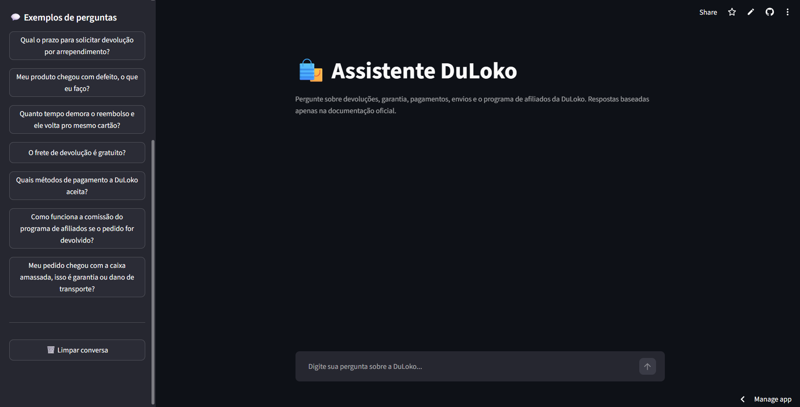
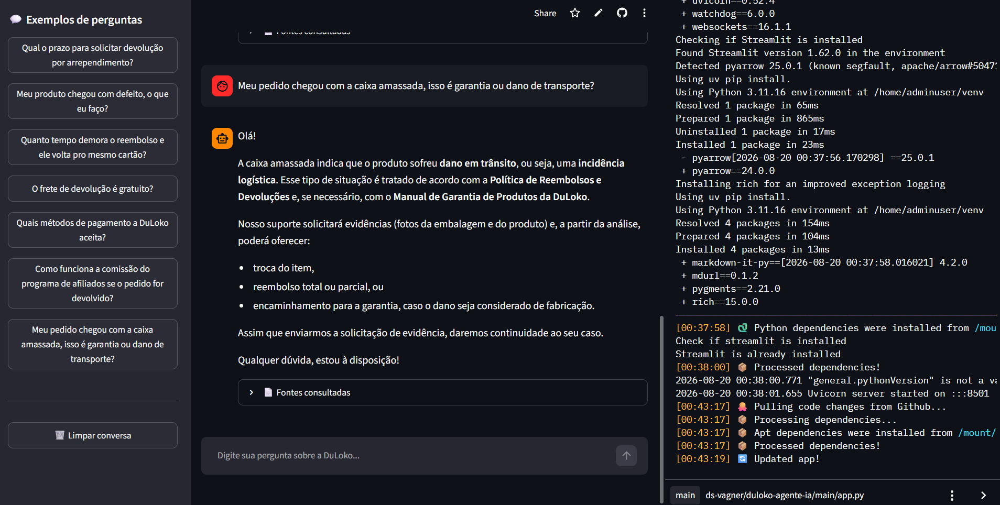
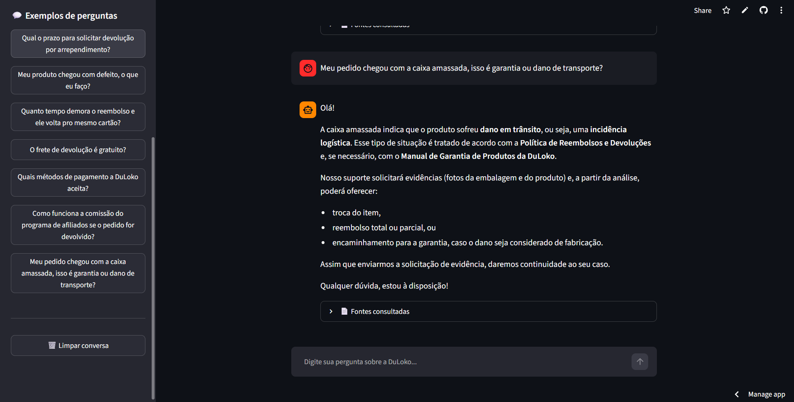
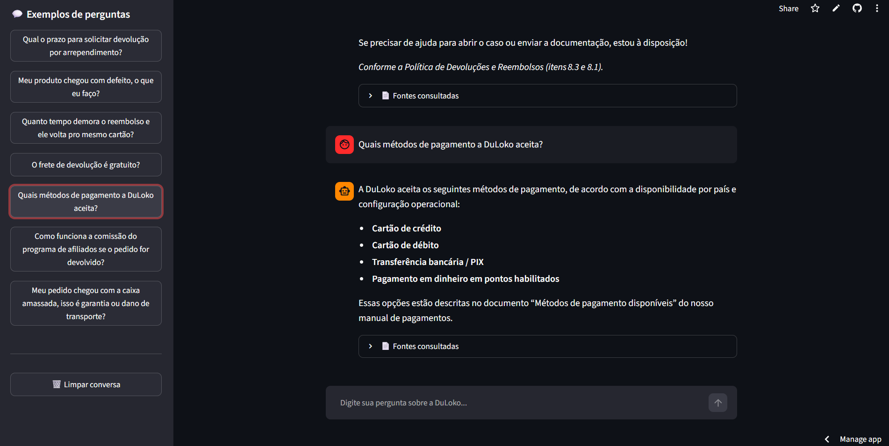
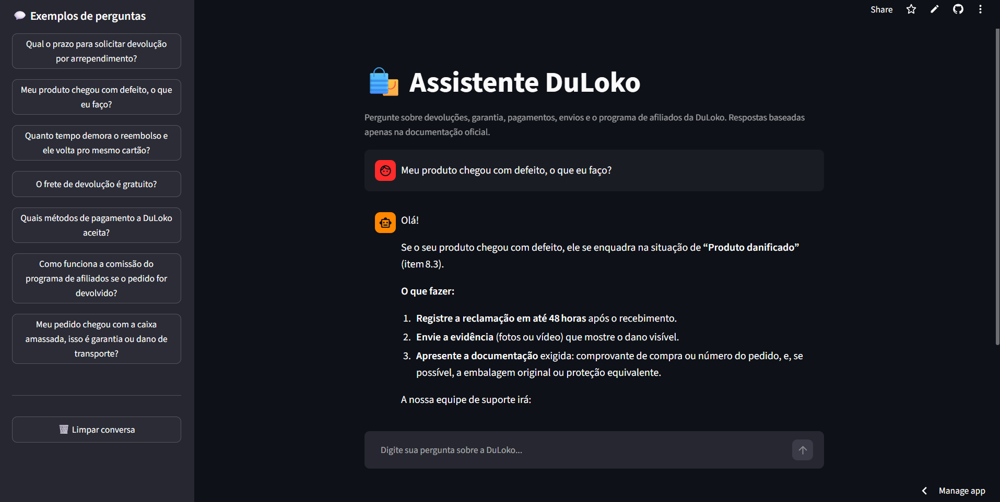

# 🛍️ Agente DuLoko — Assistente Inteligente de Atendimento (RAG)

Agente de IA para atendimento ao cliente da **DuLoko**, uma loja virtual fictícia que opera na América Latina. O agente responde perguntas sobre devoluções, garantia, pagamentos, envios e o programa de afiliados, com base **exclusivamente** na documentação oficial da empresa — usando uma arquitetura de **RAG (Retrieval-Augmented Generation)** para evitar respostas inventadas.

Projeto desenvolvido para o **Challenge Alura Agente — Tech AI Builder / Oracle Next Education (ONE)**.

---

## 📌 Descrição geral

A DuLoko forneceu 5 documentos internos que normalmente exigiriam que um atendente lesse dezenas de páginas para responder a uma única dúvida de cliente. O agente lê esses documentos, os transforma em uma base de conhecimento vetorial pesquisável e responde perguntas em linguagem natural, sempre indicando qual documento fundamenta cada resposta.

**Documentos da base de conhecimento** (pasta `data/`):
| Arquivo | Conteúdo |
|---|---|
| `reembolsos_e_devolucoes.pdf` | Prazos, condições, fluxo de atendimento e casos elegíveis/não elegíveis para devolução |
| `garantia_de_produtos.pdf` | Cobertura, exclusões, tipos de resolução (reparo/troca/reembolso) e diagnóstico |
| `metodos_de_pagamento.pdf` | FAQ sobre cartões, Pix, boleto, recusas, estornos e cobranças duplicadas |
| `prazos_e_custos_de_envio.pdf` | Prazos por região, cálculo de frete, frete grátis, incidências logísticas |
| `programa_de_afiliacao.pdf` | Regras de comissão, atribuição de vendas, reversão por devolução |

Os documentos se referenciam entre si (ex: garantia aponta para devolução, afiliados aponta para reembolso), o que exige que o agente recupere e combine trechos de **mais de um documento** para responder bem certas perguntas — um bom teste de qualidade para RAG.

---

## 🏗️ Arquitetura da solução

```
┌───────────────────────────┐
│   5 PDFs oficiais (data/)  │
└─────────────┬──────────────┘
              │  scripts/build_index.py
              ▼
┌───────────────────────────┐
│ 1. Leitura + Chunking       │  src/document_loader.py
│    (pypdf, ~900 caracteres) │
└─────────────┬──────────────┘
              ▼
┌───────────────────────────┐
│ 2. Embeddings locais         │  src/embeddings.py
│    (sentence-transformers,   │
│    modelo multilíngue, CPU)  │
└─────────────┬──────────────┘
              ▼
┌───────────────────────────┐
│ 3. Índice vetorial FAISS      │  src/vector_store.py
│    (persistido em /index)     │
└─────────────┬──────────────┘
              │
   Usuário ──▶│ 4. Busca por similaridade
   (pergunta) │    (top-8 chunks mais relevantes)
              ▼
┌───────────────────────────┐
│ 5. Geração da resposta        │  src/llm.py + src/rag_engine.py
│    (Groq — GPT-OSS 120B)      │
└─────────────┬──────────────┘
              ▼
   Interface Streamlit (app.py) ──▶ Resposta + fontes consultadas
```

**Por que essa combinação?**
- **Embeddings locais (sentence-transformers)**: rodam de graça, sem limite de requisições e sem depender de uma segunda API — só usam CPU.
- **Groq para o chat**: modelo `openai/gpt-oss-120b`, tier gratuito generoso, respostas rápidas.
- **FAISS**: índice vetorial leve, persistido em disco — não precisa reprocessar os PDFs a cada reinício.
- **Streamlit**: interface de chat pronta, com deploy simples tanto localmente quanto na nuvem.

---

## 🧰 Tecnologias e ferramentas utilizadas

| Camada | Tecnologia |
|---|---|
| Linguagem | Python 3.11+ |
| Interface | Streamlit |
| LLM (geração de respostas) | Groq API — `openai/gpt-oss-120b` |
| Embeddings | sentence-transformers (`paraphrase-multilingual-MiniLM-L12-v2`), local |
| Banco vetorial | FAISS (`faiss-cpu`) |
| Leitura de PDF | pypdf |
| Testes | Pytest |
| Empacotamento | Docker |
| Deploy | Oracle Cloud Infrastructure (VM Compute — Always Free tier) |
| Versionamento | Git / GitHub |

---

## 📁 Estrutura do repositório

```
duloko-agente-ia/
├── app.py                    # Interface Streamlit (chat)
├── src/
│   ├── config.py              # Configurações via variáveis de ambiente
│   ├── document_loader.py     # Leitura e chunking de PDF/CSV
│   ├── embeddings.py          # Embeddings locais (sentence-transformers)
│   ├── vector_store.py        # Índice vetorial FAISS
│   ├── llm.py                 # Integração com a Groq (geração da resposta)
│   └── rag_engine.py          # Orquestração do fluxo RAG
├── scripts/
│   └── build_index.py         # Script de ingestão (roda antes do app subir)
├── data/                      # Documentos fonte (PDFs da DuLoko)
├── tests/
│   └── test_agente.py         # Testes automatizados
├── docs/prints/                # Capturas de tela do deploy (evidência)
├── Dockerfile
├── requirements.txt
├── .env.example
└── README.md
```

---

## ▶️ Instruções para executar o projeto

### 1. Pré-requisitos
- Python 3.11+
- Uma chave gratuita da Groq: [console.groq.com/keys](https://console.groq.com/keys)

### 2. Instalação local

```bash
git clone https://github.com/SEU-USUARIO/duloko-agente-ia.git
cd duloko-agente-ia

python -m venv .venv
source .venv/bin/activate        # Windows: .venv\Scripts\activate

pip install -r requirements.txt

cp .env.example .env
# edite o .env e cole sua GROQ_API_KEY
```

### 3. Construir o índice vetorial (ingestão dos documentos)

```bash
python scripts/build_index.py
```

Isso lê os PDFs em `data/`, gera os embeddings localmente (baixa o modelo na primeira vez, ~470MB) e salva o índice em `index/`.

### 4. Rodar a aplicação

```bash
streamlit run app.py
```

Acesse em `http://localhost:8501`.

### 5. Rodar os testes

```bash
pytest
```

### 6. Rodar via Docker

```bash
docker build -t agente-duloko .
docker run -p 8501:8501 --env-file .env agente-duloko
```

---

## ☁️ Deploy

O agente foi publicado no **Streamlit Community Cloud**, direto a partir deste repositório GitHub — a cada `git push` na branch `main`, o deploy pode ser atualizado com um "Reboot" manual do app.

O índice vetorial (pasta `index/`) já vem pré-processado e versionado no repositório, para que o app suba pronto para uso, sem precisar reprocessar os PDFs a cada reinício.

- 🔗 **URL pública:** https://duloko-agente.streamlit.app/
- 📸 **Captura de tela:**


## 🖼️ Capturas de tela







---

## 💬 Exemplos de perguntas que o agente consegue responder

- "Qual o prazo para solicitar devolução por arrependimento?"
- "Meu produto chegou com defeito, isso é garantia ou devolução?"
- "Quanto tempo demora o reembolso depois de aprovado?"
- "O frete de devolução é gratuito?"
- "Quais métodos de pagamento a DuLoko aceita?"
- "Minha comissão de afiliado é revertida se o cliente devolver o produto?"
- "Meu pedido chegou com a caixa amassada, isso é dano de transporte ou defeito de fábrica?"

## 🗣️ Exemplos de respostas geradas pelo agente

**Pergunta:** *"Qual o prazo para solicitar devolução por arrependimento?"*

> O cliente pode solicitar devolução por arrependimento dentro de **10 dias corridos** após o recebimento do pedido, desde que o produto cumpra os requisitos de elegibilidade (embalagem original, sem sinais de uso incompatíveis, com acessórios e manuais).
>
> **Fontes:** `reembolsos_e_devolucoes.pdf`

**Pergunta:** *"Meu pedido chegou com a caixa amassada, isso é garantia ou dano de transporte?"*

> Se o dano foi identificado no recebimento, você deve relatar em até **48 horas**. A equipe vai avaliar se é dano em trânsito ou defeito de fábrica com base no estado da embalagem, o tipo de dano e o momento da detecção — se parecer defeito de fábrica (não relacionado ao transporte), o caso é avaliado conforme o Manual de Garantia; se for claramente dano de transporte, segue pela Política de Reembolsos e Devoluções.
>
> **Fontes:** `garantia_de_produtos.pdf`, `reembolsos_e_devolucoes.pdf`, `prazos_e_custos_de_envio.pdf`

**Pergunta:** *"Minha comissão de afiliado é revertida se o cliente devolver o produto?"*

> Sim. Se um pedido indicado por um afiliado terminar em devolução ou reembolso, a comissão pode ser ajustada ou revertida conforme a política interna da DuLoko e a elegibilidade final da venda.
>
> **Fontes:** `programa_de_afiliacao.pdf`, `reembolsos_e_devolucoes.pdf`

> As respostas acima foram validadas manualmente com base no conteúdo real dos documentos em `data/`. O texto exato gerado pela Groq pode variar levemente a cada execução.

---

## 🧪 Testes automatizados

```bash
pytest -v
```

Cobrem: divisão de texto em chunks, leitura real dos 5 PDFs da DuLoko (confirma que cada documento foi processado) e a estrutura de resposta do agente.

---

## ⚠️ Limitações conhecidas

- O índice é reconstruído inteiramente a cada `build_index.py`; para uma base maior, valeria migrar para atualização incremental.
- Não há autenticação na interface — para um cenário real de produção, seria necessário adicionar login.
- Não há memória de longo prazo entre sessões (o histórico de chat vive apenas na sessão do Streamlit).
- O agente responde apenas com base nos 5 documentos fornecidos; perguntas fora desse escopo recebem a resposta padrão de "não encontrado".
